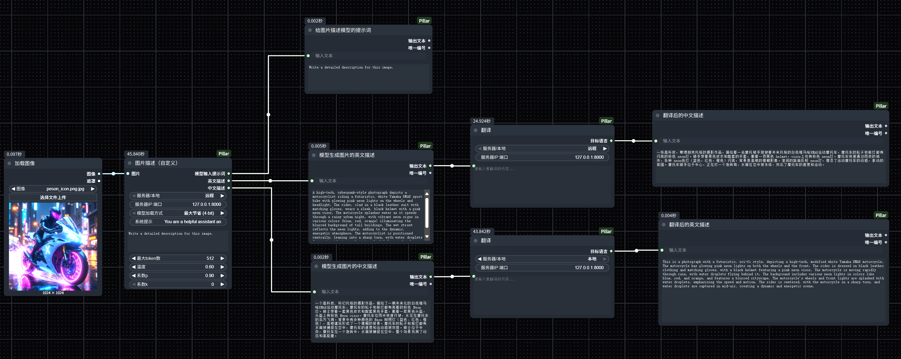

[简体中文](README_zh-cn.md)
## Pillar for ComfyUI
    Pillar is an extension plugin for ComfyUI, providing the ability to call local distributed services for ComfyUI. Currently, it integrates the llama-joycaption-beta-one-hf-llava model and offers a distributed deployment solution to solve the problem that the model occupies too many resources and affects the image generation efficiency.
---

## Nodes Provided by Pillar


1. **Preview Text Node**
Displays text information.
2. **Translation Node**
   Translates between Chinese and English. It automatically detects the input language type. When the input language is Chinese, it translates to English; otherwise, it translates to Chinese.
   * **Server/Local**: Local: Calls the model on the current physical machine. Remote: Calls the model distributed service via the Http protocol.
3. **JoyCaption Node**
   Outputs an image description based on the input prompt options.
   * **Server/Local**: Local: Calls the model on the current physical machine. Remote: Calls the model distributed service via the Http protocol.
   * **Server IP:Port**: This parameter has no effect in local mode. In remote mode, fill in the IP and port of the remote server in the format: 192.168.1.100:8000.
   * **Model Loading Mode**:Only valid in local mode. Options: Maximum Savings (4-bit), Balance (8-bit), Default Mode, with memory usage of approximately 4.2G, 8.5G, and 17G respectively.
   * **Description Type**: Allows the model to output the image description according to the selected type. Supported options: Detailed Description, Detailed Description (Casual), Direct Description, Stable Diffusion Prompt, MidJourney Prompt, Danbooru Tag List, e621 Tag List, Rule34 Tag List, Booru-like Tag List, Art Critic, Product List, Social Media Post.
   * **Description Length**: Limits the output length of the model. Supported options: Any, Very Short, Short, Medium Length, Long, Very Long, Specified Token Length (20, 30, ...).
   * **Additional Option 1**: Provides progressive hints on how the model should generate the image description. Supported options: If there are people/characters in the picture, you must refer to them as {name}. Do not include unchangeable information (such as race, gender, etc.), but still include changeable attributes (such as hairstyle). Include information about lighting. And so on.
   * **Additional Option 2**: Same as above.
   * **Additional Option 3**: Same as above.
   * **Person's Name**: Used in conjunction with the option "If there are people/characters in the picture, you must refer to them as {name}." The name here will replace {name} above.
   * **Maximum Tokens**: Limits the calculation scale of the model. The larger the token, the longer the model calculation takes.
   * **Temperature**: Adjusts the randomness and creativity of the generated text. The value range is usually 0.0 - 2.0, with a default value of approximately 0.7. A smaller value (close to 0): The output is more deterministic and focused, tending to select the word with the highest probability, and the generated content is more conservative and accurate but may be more stereotyped. A larger value (above 1.0): The output is more random and diverse, allowing the model to explore low-probability words, and the generated content is more creative but may deviate more from the theme or have logical errors. Application scenarios: For precise answers (such as mathematical calculations, factual statements): Use a low temperature (0.2 - 0.5). For creative content (such as story writing, poetry generation): Use a high temperature (0.7 - 1.0).
   * **Top P**: Top-P Sampling (Nucleus Sampling) function: Dynamically selects candidate words so that words with a cumulative probability exceeding the threshold P (such as 0.9) enter the candidate set. Value: P is a probability value (such as P = 0.9). A smaller P: Fewer candidate words, and the generation is more deterministic. A larger P: More candidate words, approaching random sampling. Advantage: Adaptively adjusts the number of candidate words, avoiding completely excluding high-quality but low-probability words (compared to Top-K). Application scenarios: To balance diversity and rationality: Commonly use P = 0.8 - 0.95.
   * **Top K**:  Top-K Sampling function: Limits the candidate word range when the model generates the next word, only selecting from the K words with the highest probability. Value: K is a positive integer (such as K = 40). A smaller K: Fewer candidate words, and the generation is more focused but may lead to repetitive or stereotyped expressions. A larger K: More candidate words, and the generation is more flexible but may introduce irrelevant vocabulary. Application scenarios: To prevent the model from generating low-quality vocabulary: Set an appropriate K (such as 50 - 100). When strict content control is required: Use a smaller K (such as 20 - 30).
4. **Joy Caption (Custom)**
   Allows for custom prompts, which is more flexible and an extension of the image description node. Supports both Chinese and English prompts and outputs an image description.
   * **Server/Local**: Same as the JoyCaption node. See the details in the image description node.
   * **Model Loading Mode**:Same as the JoyCaption node. See the details in the JoyCaption node.
   * **System Prompt**:Customize the system prompt to tell the model its role.
   * **User Prompt**:The user's prompt to tell the model how to describe the picture.
   * **最大token数**: Same as the JoyCaption node. See the details in the JoyCaption node.
   * **温度**: Same as the JoyCaption node. See the details in the JoyCaption node.
   * **系数P**: Same as the JoyCaption node. See the details in the JoyCaption node.
   * **系数K**: Same as the JoyCaption node. See the details in the JoyCaption node.

---

## **Example Workflow**
    This workflow demonstrates how to use all the nodes in Pillar. First, load an image, then use the image description node (custom) to generate Chinese and English descriptions of the image. Then use the translation node to translate the Chinese description of the image into English and the English description into Chinese. Finally, use the preview text node to display the translated content. Applicable scenarios: Image-to-image generation, extracting the main features from the image, generating an image description, making local adjustments to the description, and then performing secondary rendering to generate an image.

---

## Installation Guide

### **Recommended**
* Through [ComfyUI-Manager](https://github.com/ltdrdata/ComfyUI-Manager). Search for `Pillar_For_ComfyUI` and click to install.

### **Manual Installation**
* Navigate to the `ComfyUI/custom_nodes` directory in the terminal (cmd).
* Use the following commands to clone the repository in the `custom_nodes` directory:
  ```
  git clone https://github.com/aicoder-max/Pillar_For_ComfyUI
  cd Pillar_For_ComfyUI
  ```
* Install the dependencies in the Python environment：
    * For Windows Portable, run the following command in the `ComfyUI\custom_nodes\Pillar_For_ComfyUI` directory:
        ```
        ..\..\..\python_embeded\python.exe -m pip install -r requirements.txt
        ```
    * If using a virtual environment (venv) or Conda: First activate the Python environment, then run：
        ```
        pip install -r requirements.txt
        ```
 ## Piller Service GitHub
[GitHub: ](https://github.com/aicoder-max/Pillar_Service)https://github.com/aicoder-max/Pillar_Service