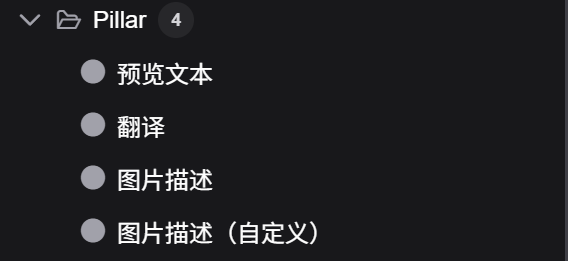

## Pillar for ComfyUI
    Pillar 是一款 ComfyUI 扩展插件，为 ComfyUI 提供调用本地分布式服务的能力。目前集成[llama-joycaption-beta-one-hf-llava](https://huggingface.co/fancyfeast/llama-joycaption-beta-one-hf-llava)模型，提供分布式部署方案，解决模型占用过多资源，影响生图效率的问题。
---

## Pillar 提供以下节点



1. **预览文本节点**
展示文本信息。
2. **翻译节点**
   中文和英文两种语言互译，自动检测输入语言类型，当输入语言为中文时，则翻译为英文，反之，则翻译为中文。
   * **服务器/本地**: 本地：当前物理机调用模型。远程：通过Http协议调用模型分布式服务。
3. **图片描述节点**
   根据输入提示词选项，输出图片描述。
   * **服务器/本地**: 本地：当前物理机调用模型。远程：通过Http协议调用模型分布式服务。
   * **服务器IP:端口**: 本地模式下该参数不起作用。远程模式下，该参数填写远程服务器IP:端口，填写格式为：192.168.1.100:8000
   * **模型加载方式**:只对本地模式下有效。选项：最大节省 (4-bit)、平衡 (8-bit)、默认模式 ，内存占用分别约为：4.2G、8.5G、17G
   * **描述类型**: 让模型按照选定类型输出图片描述。支持选项：详细描述、详细描述（随意）、直接描述、Stable Diffusion 提示、MidJourney 提示、Danbooru 标签列表、e621 标签列表、Rule34 标签列表、Booru-like 标签列表、艺术评论家、产品列表、社交媒体帖子
   * **描述长度**: 限制模型输出长度。支持选项：任意、非常短、短、中等长度、长、非常长、指定token长度（20、30、...）
   * **附加选项1**: 进步提示模型应该如何生成图片描述，支持选项：如果图片中有人物 / 角色，你必须用 {name} 来称呼他们。、不要包含无法改变的信息（如种族、性别等），但仍应包含可改变的属性（如发型）。、包含关于照明信息。略...
   * **附加选项2**: 同上。
   * **附加选项3**: 同上。
   * **人名**: 与附加选项中：如果图片中有人物 / 角色，你必须用 {name} 来称呼他们。配合使用，这里的人名将替换前面的{name}。
   * **最大token数**: 限制模型计算规模，token越大，模型计算越耗时越长。
   * **温度**: 调整生成文本的随机性和创造性，取值范围：通常为 0.0~2.0，默认值约 0.7。值越小（接近 0）：输出更确定性、聚焦，倾向于选择概率最高的词，生成内容更保守、准确，但可能更刻板。 值越大（如 1.0 以上）：输出更随机、多样，允许模型探索低概率词，生成内容更有创造性，但可能更偏离主题或出现逻辑错误。应用场景： 需精确答案时（如数学计算、事实陈述）：用低温（0.2~0.5）。 需创意内容时（如故事写作、诗歌生成）：用高温（0.7~1.0）。
   * **系数P**: Top-P Sampling（Nucleus Sampling，核采样）作用：动态选择候选词，使累积概率超过阈值 P（如 0.9）的词进入候选集。取值：P 为概率值（如 P=0.9）。 P 越小：候选词越少，生成越确定性。 P 越大：候选词越多，接近随机采样。优势：自适应调整候选词数量，避免高质量但低概率的词被完全排除（对比 Top-K）。 应用场景： 平衡多样性与合理性：常用 P=0.8~0.95。
   * **系数K**:  Top-K Sampling（Top-K 采样）作用：限制模型在生成下一个词时的候选词范围，只从概率最高的 K 个词中选择。取值：K 为正整数（如 K=40）。 K 越小：候选词越少，生成越聚焦，但可能导致重复或刻板表达。 K 越大：候选词越多，生成更灵活，但可能引入无关词汇。应用场景： 防止模型生成低质量词汇：设置适当的 K（如 50~100）。 需严格控制内容时：用较小的 K（如 20~30）。
4. **图片描述（自定义）**
   自定义提示词，更灵活，对图片描述节点的扩充。支持中文、英文两种提示，输出图片描述。
   * **服务器/本地**: 本地：当前物理机调用模型。远程：通过Http协议调用模型分布式服务。
   * **模型加载方式**:同图片描述节点，详情参见图片描述节点。
   * **系统提示词**:自定义系统提示词，告诉模型它的角色。
   * **用户提示词**:用户提示词，告诉模型应该如何对图片进行描述。
   * **最大token数**: 同图片描述节点，详情参见图片描述节点。
   * **温度**: 同图片描述节点，详情参见图片描述节点。
   * **系数P**: 同图片描述节点，详情参见图片描述节点。
   * **系数K**: 同图片描述节点，详情参见图片描述节点。

---

## **示例工作流**
    这个工作流展示了如何使用 Pillar 的中的所有节点。首先加载一张图片，然后使用图片描述节点（自定义），生成图片中文、英文描述。然后使用翻译节点，将图片中文描述翻译为英文，英文描述翻译为中文。最后，使用预览文本节点，展示翻译后内容。适用场景：图生图，提取图片中主要特征，生成图片描述，对描述进行局部调整，再二次渲染生图。

---

## 如何安装

### **推荐方式**
* 通过 [ComfyUI-Manager](https://github.com/ltdrdata/ComfyUI-Manager). 搜索 `Pillar_For_ComfyUI`，并点击安装。

### **手动安装**
* 在终端（cmd） 导航至`ComfyUI/custom_nodes` 目录.
* 在 `custom_nodes` 目录下使用以下命令克隆仓库:
  ```
  git clone https://github.com/aicoder-max/Pillar_For_ComfyUI
  cd Pillar_For_ComfyUI
  ```
* 在 Python 环境中安装依赖项：
    * Windows Portable 在 `ComfyUI\custom_nodes\Pillar_For_ComfyUI`目录内运行以下命令:
        ```
        ..\..\..\python_embeded\python.exe -m pip install -r requirements.txt
        ```
    * 若使用虚拟环境（venv）或 Conda：先激活 Python 环境，再运行：
        ```
        pip install -r requirements.txt
        ```
 ## Piller 服务端项目地址：
[GitHub: ](https://github.com/aicoder-max/Pillar_Service)https://github.com/aicoder-max/Pillar_Service